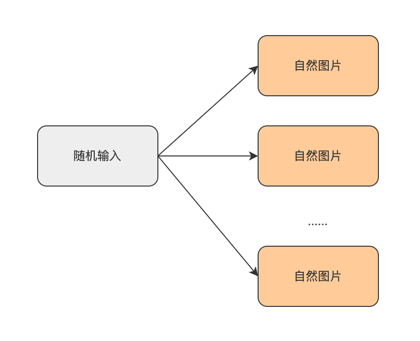
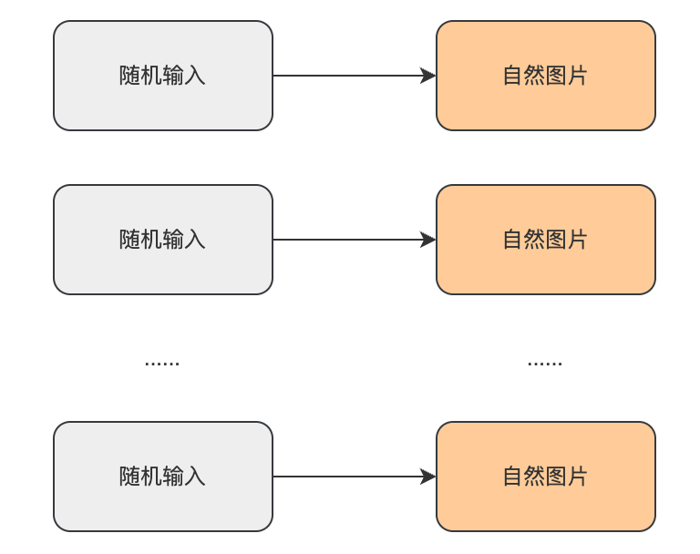
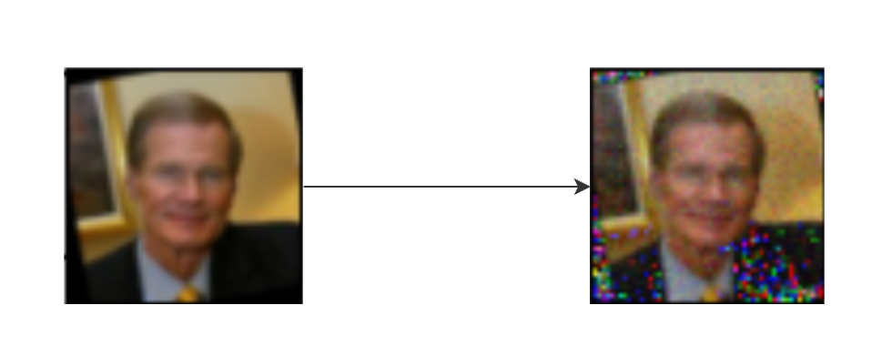
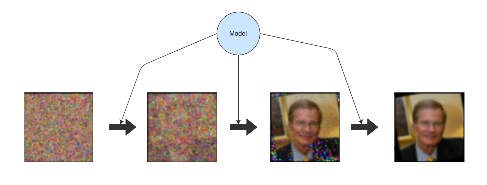
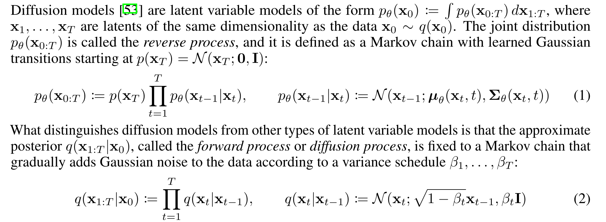
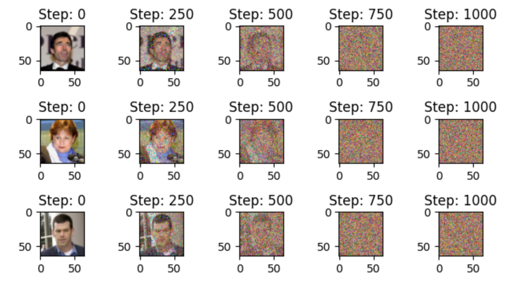
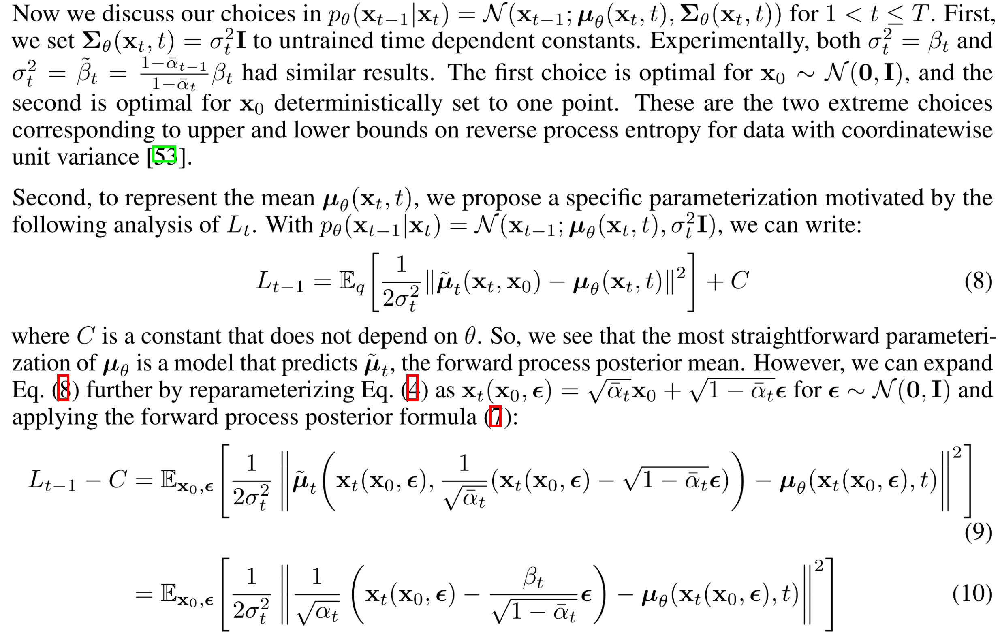
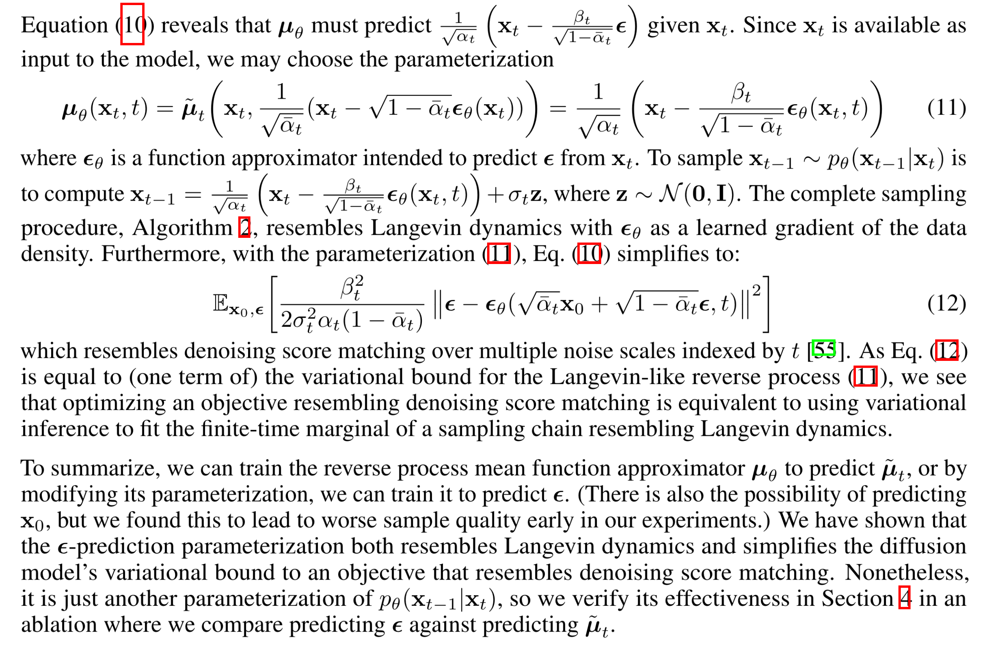
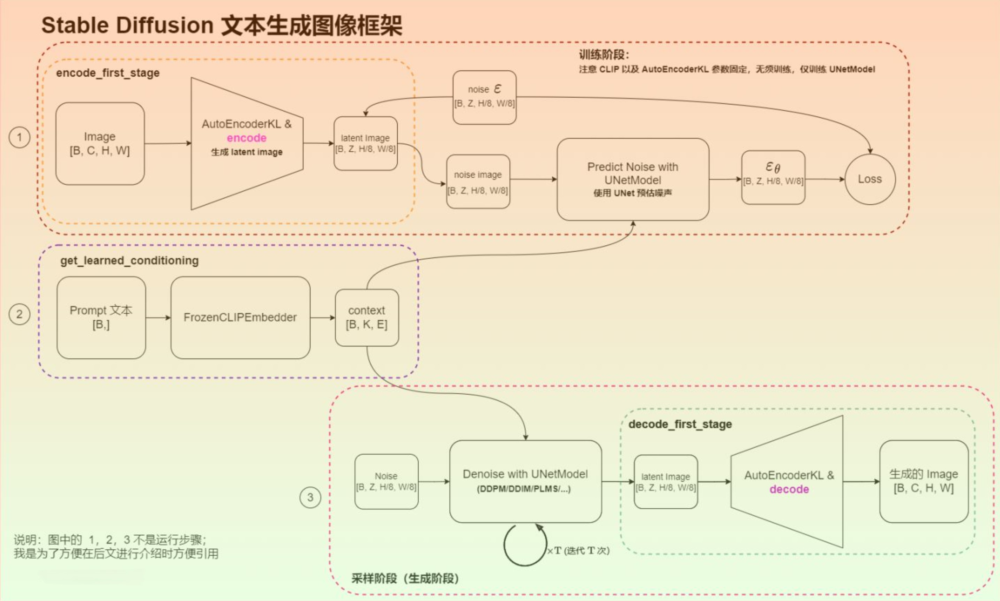

# 来聊一下扩散呗
## 从一张纯随机图片开始说起......

想象一下，如何让计算机凭空去创造一张自然的数字图像呢？计算机可以凭空生成一张纯随机图像，但随机图像是没有意义的。但所谓自然数字图像，其实就是一堆相互之间符合某种分布的像素点的集合，而一张纯随机的图片，实质上就是像素点都是独立分布的（例如每一个像素都独立服从标准高斯分布）。

那要想让计算机凭空创造一张自然图像，其实就是对随机图像中的像素点进行一些处理，使其这些像素点之间的联系在处理后也能服从像自然图片一样的分布，即完成从随机图像到自然图像的映射，从而达到了让计算机凭空生成自然图片的目的。

不妨我们先假设存在这么一个黑盒模型，它需要完成 “随机图像” -> “自然图像” 这样的映射。
    


好了，现在，我们只需要找数据，然后学习这样的映射关系就行了，随机图片就随机生成就好了，自然图片找个图片数据集或自己动手合法地爬一些就搞定了，讲解结束~，不过，客官且慢。

## 这个任务有点难......

不妨深挖一下，这个任务有点难搞，怎么个难搞？试想一下，自然图片和生成的随机图片之间没有什么“关系”，硬学一个这个“关系”出来，恐怕没那么容易，因为，随机图片在生成的时候，是纯随机的，要想建立这样的数据集，最直接能想到的，大概就这两种方式:

+ 第一种，随机输入 -> 随机自然图片

+ 第二章，随机图片到自然图片的意义映射


以上的两种方法，都无法保证模型要学习的这个“关系”的稳定性，即可能存在以下情况：
+ 本轮学习，随机A隐射到自然A（随机A->自然A），下一轮学习，随机A学习隐射到自然B（随机A->自然B）；
+ 同一轮学习中，随机A到自然A的映射 与 随机B到自然B的映射 并不存在或者本身就是矛盾的；

综上，构造这个数据集需要一些技巧或者方法。

## 前向扩散

从上面的分析来看，在训练这个黑盒模型时，需要在数据集中建立"随机"->"自然"之间的稳定关系，我们可以从"自然"图片入手，通过向自然图片加入高斯噪声，使其成为像素的分布也成为服从标准高斯分布的伪随机图像。这样生成的数据集，接没有上面的不稳定的问题了，图像的噪声怎么加来着？上公式：

$X_{noised} = a * X + b * N$

其中$X_{noised}$代表加了噪声的图像，$X$代表原图像，$N$代表噪声，a代表原图像的保留强度，b代表加入噪声的强度，不妨称它们为信号率和噪声率，来看看效果



这次在a比较大b比较小时的效果，加噪后的图像显然和平时所看到的雪花噪声图还差得很远很远，没关系，我可可以多加几次或者把a调小，把b调大，这些都是可以操作的参数，但是真的可以随表调吗？答案是可以，不过有一个前提，就是加噪后的图像，其像素点也需要服从标准高斯分布，这样才可以和我们的初衷对应上了（输入纯噪声输出自然图像），这里就会对a和b这两个值有一定的限制，可以简单推导一下：
1. 首先噪声$N$是我们操控的，是可以确定它来自标准高斯分布，记作$N \sim N(0,1)$；
2. $X$是自然图像，一般情况下，我们在做训练时，都会将其进行Normalize，所以$X$也可以服从标准高斯分布，，记作$N \sim N(0,1)$；
3. $X_{noised}$是两个高斯分布变量之和，根据高斯分布的性质，可以得到$X_{noised}服从均值0，方差
    $a^2+b^2$的高斯分布，记为$X_{noised} \sim N(0,a^2+b^2)$；
4. 要想$X_{noised}$也服从标准高斯分布，就必须保证$a^2+b^2=1$，也就是a和b各自平方的和等于1。

然后，如果一开始就给一个很小的a一个很大的b，让模型直接一步去拟合出$X$，不过这么训练出现的模型的泛化性可能就有点弱了，一般情况下，我们会把去噪任务拆解成多轮的形式进行，让模型看见更多不同的程度噪声，挺高数据利用率，同时提高模型的泛化能力。



上面的推导，只要一直保证$a^2+b^2=1$，推广到多次加噪声，最终出来的加噪图像，还是服从标准高斯分布的，证明如下：
1. 假设$X_t$代表加噪t轮后的图像，$a_t$和$b_t$表示第t轮的信号率和噪声率，由于$a_t^2+b_t^2=1$的性质存在，可以记$b_t=\sqrt{\beta_t}$ $a_t=\sqrt{1-\beta_t}$;
2. 有$X_1 = \sqrt{1-\beta_1} * X_0 + \sqrt{\beta_1} * N(0, 1)$，即有$X_1 \sim N(0, 1 - \beta_1 + \beta_1) = N(0, 1)$
3. 有$X_t = \sqrt{1-\beta_t} * X_{t-1} + \sqrt{\beta_t} N(0, 1)$，最后还是有$X_t \sim N(0, 1 - \beta_t + \beta_t) = N(0, 1)$

以上的推导，是对[DDPM](http://arxiv.org/abs/2006.11239)中，diffuse过程的一个简明的说明，论文中还介绍一个可以在扩散过程把n步简化成1步的公式证明，如果感兴趣，可以直接观看论文。




我们不妨把从自然图像中生成这样的噪声图像的过程称为扩散。



有了这些和自然图像有关系的随机图像后，下一步就是训练模型呗。

## 优化目标是什么？

一个比较直观的训练方法，就是直接拿加噪声的后图片放进模型中进行推理，在获得结果后，直接计算这个结果和原图的差异，再进行梯度下降，如下图所示：


这么做，也不是不行，不过原论文有一个数学上的描述：





总的来说，我们可以直接从自然图像与去噪图像的差异来获得梯度，也可以从生成噪声和估计噪声来获得梯度，两者从理论上讲，区别不大，不过一般情况，更倾向于后者，因为去噪图片中包含了自然图像的信息，对模型来说还需要预测这部分的数据，对模型来说是一个负担，相比之下，让模型学习噪声会更容易些，这个和ResNet中，让模型来学习残差的思路有异曲同工之妙吧。


## Talk is cheap, show me the code......

代码我上载在[Github](https://github.com/Qero/UnderstandDiffusionModels)上，模型使用的是一个RessUNet，模型的输入除了加噪图像本身以外，还有对目前采样步数的一个emb，embedding的方法比较简单：

```python
def step_embedding(step):
    self._step_angular_speeds = self._step_angular_speeds.to(step.device)
    emb = torch.concat([
        torch.sin(self._step_angular_speeds * step), 
        torch.cos(self._step_angular_speeds * step)], axis=-1
    )
    return emb
```

其他更多的细节就不在此处详述了，详情可以直接参考代码，以下是训了45个epoch后的效果


一个采样的动图


## 后续

对于扩散模型来说，上面介绍得差不多了，扩散模型，目前最大的应用莫过于AIGC了。从目前应用广泛性来看，Stable Diffusion(SD) 应该算是比较热门的模型，其核心其实就是本文介绍扩散模型，此处引用一张别人的图片，可以对简单SD算法的工作原理了解一下：



SD模型的核心还是中间的这个扩散模型，不过增多了几个关键部件，一个处理Prompt的文本模型和一个压缩图片的自编码器，还有在上图没显示的一个关键组件--在采样过程中融合文本特征和图像特征的CrossAttention。当然SD的新特性显然不止这些，还有各种finetune的技巧（例如[LoRA](https://github.com/cloneofsimo/lora)、[LoHa](https://openreview.net/pdf?id=d71n4ftoCBy)、[LyCORIS](https://github.com/KohakuBlueleaf/LyCORIS)等）。限于篇幅，对SD的详细说明就不在此处进行了，待后面在本地实现SD后，再来写一篇分享吧~

## Refs.
1. [DDPM](https://arxiv.org/abs/2006.11239) 必看
2. [DDIM](https://arxiv.org/abs/2010.02502) 裂墙推荐
3. [PNMD](https://link.zhihu.com/?target=https%3A//arxiv.org/abs/2112.10752) 推荐